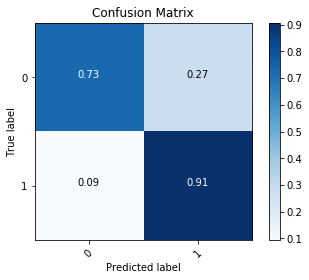
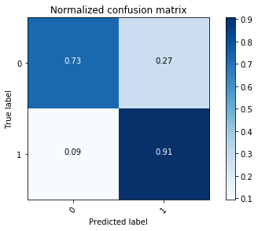

# Visualizing Confusion Matrices - Lab

## Introduction

In this lab, you'll build upon the previous lesson on confusion matrices and create a confusion matrix visualization using matplotlib. 

## Objectives

You will be able to:
* Create visualizations of a confusion matrix
* Interpret a confusion matrix to assess model performance

## Confusion matrices

Recall that the confusion matrix represents the counts (or normalized counts) of our True Positives, False Positives, True Negatives, and False Negatives. This can further be visualized when analyzing the effectiveness of our classification algorithm.   
  
Here's an example of generating a confusion matrix:


With that, let's look at some code for generating this visual.

## Create our model
As usual, start by fitting a model to data by importing, normalizing, splitting into train and test sets and then calling your chosen algorithm.


```python
from sklearn.linear_model import LogisticRegression
from sklearn.model_selection import train_test_split
import pandas as pd


#Load the data
df = pd.read_csv('heart.csv')

#Define appropriate X and y
X = df[df.columns[:-1]]
y = df.target

#Normalize the Data
for col in df.columns:
    df[col] = (df[col]-min(df[col]))/ (max(df[col]) - min(df[col]))

# Split the data into train and test sets.
X_train, X_test, y_train, y_test = train_test_split(X, y, random_state=0)

#Fit a model
logreg = LogisticRegression(fit_intercept = False, C = 1e12) #Starter code
model_log = logreg.fit(X_train, y_train)
print(model_log) #Preview model params

#Predict
y_hat_test = logreg.predict(X_test)

#Data Preview
df.head()
```

    LogisticRegression(C=1000000000000.0, class_weight=None, dual=False,
              fit_intercept=False, intercept_scaling=1, max_iter=10000,
              multi_class='warn', n_jobs=None, penalty='l2', random_state=None,
              solver='lbfgs', tol=0.0001, verbose=0, warm_start=False)


<div>
<style scoped>
    .dataframe tbody tr th:only-of-type {
        vertical-align: middle;
    }

    .dataframe tbody tr th {
        vertical-align: top;
    }

    .dataframe thead th {
        text-align: right;
    }
</style>
<table border="1" class="dataframe">
  <thead>
    <tr style="text-align: right;">
      <th></th>
      <th>age</th>
      <th>sex</th>
      <th>cp</th>
      <th>trestbps</th>
      <th>chol</th>
      <th>fbs</th>
      <th>restecg</th>
      <th>thalach</th>
      <th>exang</th>
      <th>oldpeak</th>
      <th>slope</th>
      <th>ca</th>
      <th>thal</th>
      <th>target</th>
    </tr>
  </thead>
  <tbody>
    <tr>
      <th>0</th>
      <td>0.708333</td>
      <td>1.0</td>
      <td>1.000000</td>
      <td>0.481132</td>
      <td>0.244292</td>
      <td>1.0</td>
      <td>0.0</td>
      <td>0.603053</td>
      <td>0.0</td>
      <td>0.370968</td>
      <td>0.0</td>
      <td>0.0</td>
      <td>0.333333</td>
      <td>1.0</td>
    </tr>
    <tr>
      <th>1</th>
      <td>0.166667</td>
      <td>1.0</td>
      <td>0.666667</td>
      <td>0.339623</td>
      <td>0.283105</td>
      <td>0.0</td>
      <td>0.5</td>
      <td>0.885496</td>
      <td>0.0</td>
      <td>0.564516</td>
      <td>0.0</td>
      <td>0.0</td>
      <td>0.666667</td>
      <td>1.0</td>
    </tr>
    <tr>
      <th>2</th>
      <td>0.250000</td>
      <td>0.0</td>
      <td>0.333333</td>
      <td>0.339623</td>
      <td>0.178082</td>
      <td>0.0</td>
      <td>0.0</td>
      <td>0.770992</td>
      <td>0.0</td>
      <td>0.225806</td>
      <td>1.0</td>
      <td>0.0</td>
      <td>0.666667</td>
      <td>1.0</td>
    </tr>
    <tr>
      <th>3</th>
      <td>0.562500</td>
      <td>1.0</td>
      <td>0.333333</td>
      <td>0.245283</td>
      <td>0.251142</td>
      <td>0.0</td>
      <td>0.5</td>
      <td>0.816794</td>
      <td>0.0</td>
      <td>0.129032</td>
      <td>1.0</td>
      <td>0.0</td>
      <td>0.666667</td>
      <td>1.0</td>
    </tr>
    <tr>
      <th>4</th>
      <td>0.583333</td>
      <td>0.0</td>
      <td>0.000000</td>
      <td>0.245283</td>
      <td>0.520548</td>
      <td>0.0</td>
      <td>0.5</td>
      <td>0.702290</td>
      <td>1.0</td>
      <td>0.096774</td>
      <td>1.0</td>
      <td>0.0</td>
      <td>0.666667</td>
      <td>1.0</td>
    </tr>
  </tbody>
</table>
</div>


```python
# __SOLUTION__ 
from sklearn.linear_model import LogisticRegression
from sklearn.model_selection import train_test_split
import pandas as pd


#Load the data
df = pd.read_csv('heart.csv')

#Define appropriate X and y
X = df[df.columns[:-1]]
y = df.target

#Normalize the Data
for col in df.columns:
    df[col] = (df[col]-min(df[col]))/ (max(df[col]) - min(df[col]))

# Split the data into train and test sets.
X_train, X_test, y_train, y_test = train_test_split(X, y, random_state=0)

#Fit a model
logreg = LogisticRegression(fit_intercept = False, C = 1e12) #Starter code
model_log = logreg.fit(X_train, y_train)
print(model_log) #Preview model params

#Predict
y_hat_test = logreg.predict(X_test)

#Data Preview
df.head()
```

    LogisticRegression(C=1000000000000.0, class_weight=None, dual=False,
              fit_intercept=False, intercept_scaling=1, max_iter=100,
              multi_class='warn', n_jobs=None, penalty='l2', random_state=None,
              solver='warn', tol=0.0001, verbose=0, warm_start=False)


    /Users/forest.polchow/anaconda3/lib/python3.6/site-packages/sklearn/linear_model/logistic.py:433: FutureWarning: Default solver will be changed to 'lbfgs' in 0.22. Specify a solver to silence this warning.
      FutureWarning)


<div>
<style scoped>
    .dataframe tbody tr th:only-of-type {
        vertical-align: middle;
    }

    .dataframe tbody tr th {
        vertical-align: top;
    }

    .dataframe thead th {
        text-align: right;
    }
</style>
<table border="1" class="dataframe">
  <thead>
    <tr style="text-align: right;">
      <th></th>
      <th>age</th>
      <th>sex</th>
      <th>cp</th>
      <th>trestbps</th>
      <th>chol</th>
      <th>fbs</th>
      <th>restecg</th>
      <th>thalach</th>
      <th>exang</th>
      <th>oldpeak</th>
      <th>slope</th>
      <th>ca</th>
      <th>thal</th>
      <th>target</th>
    </tr>
  </thead>
  <tbody>
    <tr>
      <th>0</th>
      <td>0.708333</td>
      <td>1.0</td>
      <td>1.000000</td>
      <td>0.481132</td>
      <td>0.244292</td>
      <td>1.0</td>
      <td>0.0</td>
      <td>0.603053</td>
      <td>0.0</td>
      <td>0.370968</td>
      <td>0.0</td>
      <td>0.0</td>
      <td>0.333333</td>
      <td>1.0</td>
    </tr>
    <tr>
      <th>1</th>
      <td>0.166667</td>
      <td>1.0</td>
      <td>0.666667</td>
      <td>0.339623</td>
      <td>0.283105</td>
      <td>0.0</td>
      <td>0.5</td>
      <td>0.885496</td>
      <td>0.0</td>
      <td>0.564516</td>
      <td>0.0</td>
      <td>0.0</td>
      <td>0.666667</td>
      <td>1.0</td>
    </tr>
    <tr>
      <th>2</th>
      <td>0.250000</td>
      <td>0.0</td>
      <td>0.333333</td>
      <td>0.339623</td>
      <td>0.178082</td>
      <td>0.0</td>
      <td>0.0</td>
      <td>0.770992</td>
      <td>0.0</td>
      <td>0.225806</td>
      <td>1.0</td>
      <td>0.0</td>
      <td>0.666667</td>
      <td>1.0</td>
    </tr>
    <tr>
      <th>3</th>
      <td>0.562500</td>
      <td>1.0</td>
      <td>0.333333</td>
      <td>0.245283</td>
      <td>0.251142</td>
      <td>0.0</td>
      <td>0.5</td>
      <td>0.816794</td>
      <td>0.0</td>
      <td>0.129032</td>
      <td>1.0</td>
      <td>0.0</td>
      <td>0.666667</td>
      <td>1.0</td>
    </tr>
    <tr>
      <th>4</th>
      <td>0.583333</td>
      <td>0.0</td>
      <td>0.000000</td>
      <td>0.245283</td>
      <td>0.520548</td>
      <td>0.0</td>
      <td>0.5</td>
      <td>0.702290</td>
      <td>1.0</td>
      <td>0.096774</td>
      <td>1.0</td>
      <td>0.0</td>
      <td>0.666667</td>
      <td>1.0</td>
    </tr>
  </tbody>
</table>
</div>


## Create the confusion matrix

To gain a better understanding of confusion matrices, complete the `conf_matrix` function in the cell below.  This function should:

* Take in 2 arguments: 
    * `y_true`, an array of labels
    * `y_pred`, an array of model predictions
* Return a Confusion Matrix in the form of a dictionary, where the keys are `'TP', 'TN', 'FP', 'FN'`. 


```python
def conf_matrix(y_true, y_pred):
    pass
```


```python
# __SOLUTION__ 
def conf_matrix(y_true, y_pred):
    cm = {'TP': 0, 'TN': 0, 'FP': 0, 'FN': 0}
    
    for ind, label in enumerate(y_true):
        pred = y_pred[ind]
        if label == 1:
            # CASE: TP 
            if label == pred:
                cm['TP'] += 1
            # CASE: FN
            else:
                cm['FN'] += 1
        else:
            # CASE: TN
            if label == pred:
                cm['TN'] += 1
            # CASE: FP
            else:
                cm['FP'] += 1
    return cm
```


```python
# __SOLUTION__ 
conf_matrix(y_test,y_hat_test)
```


    {'TP': 39, 'TN': 24, 'FP': 9, 'FN': 4}


## Checking Your Work with sklearn

To check your work, make use the the `confusion_matrix()` function found in `sklearn.metrics` to create some confusion matrices and make sure that sklearn's results match up with your own.

In the cells below, import the `confusion_matrix()` function, use it to create a confusion matrix for each of your models, and then compare the results with the confusion matrices we created above. 


```python

```

    Confusion Matrix:
     [[24  9]
     [ 4 39]]


```python
# __SOLUTION__ 
from sklearn.metrics import confusion_matrix

cnf_matrix = confusion_matrix(y_test, y_hat_test)
print('Confusion Matrix:\n',cnf_matrix)
```

    Confusion Matrix:
     [[24  9]
     [ 4 39]]


## Creating a Nice Visual
Creating a pretty visual is a little more complicated. Generating the initial image is simple but you'll have to use the itertools package to iterate over the matrix and append labels to the individual cells. In this example, `cnf_matrix` should be the result of the sci-kit learn implementation of a confusion matrix.


```python
import numpy as np
import itertools
import matplotlib.pyplot as plt
%matplotlib inline

plt.imshow(cnf_matrix,  cmap=plt.cm.Blues) #Create the basic matrix.

#Add title and Axis Labels
plt.title('Confusion Matrix')
plt.ylabel('True label')
plt.xlabel('Predicted label')

#Add appropriate Axis Scales
class_names = set(y) #Get class labels to add to matrix
tick_marks = np.arange(len(class_names))
plt.xticks(tick_marks, class_names, rotation=45)
plt.yticks(tick_marks, class_names)

#Add Labels to Each Cell
thresh = cnf_matrix.max() / 2. #Used for text coloring below
#Here we iterate through the confusion matrix and append labels to our visualization.
for i, j in itertools.product(range(cnf_matrix.shape[0]), range(cnf_matrix.shape[1])):
        plt.text(j, i, cnf_matrix[i, j],
                 horizontalalignment="center",
                 color="white" if cnf_matrix[i, j] > thresh else "black")

#Add a Side Bar Legend Showing Colors
plt.colorbar()
```


    <matplotlib.colorbar.Colorbar at 0x1a20aa4668>


```python
# __SOLUTION__ 
import numpy as np
import itertools
import matplotlib.pyplot as plt
%matplotlib inline

plt.imshow(cnf_matrix,  cmap=plt.cm.Blues) #Create the basic matrix.

#Add title and Axis Labels
plt.title('Confusion Matrix')
plt.ylabel('True label')
plt.xlabel('Predicted label')

#Add appropriate Axis Scales
class_names = set(y) #Get class labels to add to matrix
tick_marks = np.arange(len(class_names))
plt.xticks(tick_marks, class_names, rotation=45)
plt.yticks(tick_marks, class_names)

#Add Labels to Each Cell
thresh = cnf_matrix.max() / 2. #Used for text coloring below
#Here we iterate through the confusion matrix and append labels to our visualization.
for i, j in itertools.product(range(cnf_matrix.shape[0]), range(cnf_matrix.shape[1])):
        plt.text(j, i, cnf_matrix[i, j],
                 horizontalalignment="center",
                 color="white" if cnf_matrix[i, j] > thresh else "black")

#Add a Side Bar Legend Showing Colors
plt.colorbar()
```


    <matplotlib.colorbar.Colorbar at 0x1a161f3470>


## Create a general function that plots the confusion matrix
Generalize the above code into a function that you can reuse to create confusion matrix visuals going forward.


```python
def plot_confusion_matrix(cm, classes,
                          title='Confusion matrix',
                          cmap=plt.cm.Blues):
    #Pseudocode/Outline:
    #Print the confusion matrix (optional)
    #Create the basic matrix.
    #Add title and Axis Labels
    #Add appropriate Axis Scales
    #Add Labels to Each Cell
    #Add a Side Bar Legend Showing Colors
```


```python
# __SOLUTION__ 
def plot_confusion_matrix(cm, classes,
                          title='Confusion matrix',
                          cmap=plt.cm.Blues):
    #Pseudocode/Outline:
    #Print the confusion matrix (optional)
    #Create the basic matrix.
    #Add title and Axis Labels
    #Add appropriate Axis Scales
    #Add Labels to Each Cell
    #Add a Side Bar Legend Showing Colors
    
    print(cm)

    plt.imshow(cm, interpolation='nearest', cmap=cmap)
    plt.title(title)
    plt.colorbar()
    tick_marks = np.arange(len(classes))
    plt.xticks(tick_marks, classes, rotation=45)
    plt.yticks(tick_marks, classes)

    fmt = '.2f' if normalize else 'd'
    thresh = cm.max() / 2.
    for i, j in itertools.product(range(cm.shape[0]), range(cm.shape[1])):
        plt.text(j, i, format(cm[i, j], fmt),
                 horizontalalignment="center",
                 color="white" if cm[i, j] > thresh else "black")

    plt.tight_layout()
    plt.ylabel('True label')
    plt.xlabel('Predicted label')
```

## Update your function to include an option for normalization.
When the normalization parameter is set to True, your function should return percentages for each label class in the visual rather than raw counts.


```python
def plot_confusion_matrix(cm, classes,
                          normalize=False,
                          title='Confusion matrix',
                          cmap=plt.cm.Blues):
    #Check if Normalization Option is Set to True. If so, normalize the raw confusion matrix before visualizing
    
    #Other code should be equivalent to your previous function

    #Print the confusion matrix (optional)
    #Create the basic matrix.
    #Add title and Axis Labels
    #Add appropriate Axis Scales
    #Add Labels to Each Cell
    #Add a Side Bar Legend Showing Colors
```


```python
# __SOLUTION__ 
def plot_confusion_matrix(cm, classes,
                          normalize=False,
                          title='Confusion matrix',
                          cmap=plt.cm.Blues):
    #Add Normalization Option
    if normalize:
        cm = cm.astype('float') / cm.sum(axis=1)[:, np.newaxis]
        print("Normalized confusion matrix")
    else:
        print('Confusion matrix, without normalization')

    print(cm)

    plt.imshow(cm, interpolation='nearest', cmap=cmap)
    plt.title(title)
    plt.colorbar()
    tick_marks = np.arange(len(classes))
    plt.xticks(tick_marks, classes, rotation=45)
    plt.yticks(tick_marks, classes)

    fmt = '.2f' if normalize else 'd'
    thresh = cm.max() / 2.
    for i, j in itertools.product(range(cm.shape[0]), range(cm.shape[1])):
        plt.text(j, i, format(cm[i, j], fmt),
                 horizontalalignment="center",
                 color="white" if cm[i, j] > thresh else "black")

    plt.tight_layout()
    plt.ylabel('True label')
    plt.xlabel('Predicted label')
```

## Create a normalized confusion matrix
Call your function to create a normalized confusion matrix for the model above.


```python
# Plot normalized confusion matrix
# Your code here
```

    Normalized confusion matrix
    [[0.72727273 0.27272727]
     [0.09302326 0.90697674]]





```python
# __SOLUTION__ 
# Plot normalized confusion matrix
plt.figure()
plot_confusion_matrix(cnf_matrix, classes=class_names, normalize=True,
                      title='Normalized confusion matrix')

plt.show()
```

    Normalized confusion matrix
    [[0.72727273 0.27272727]
     [0.09302326 0.90697674]]





## Summary
Well done! In this lab, you previewed the confusion matrix and practiced matplotlib skills for producing visualizations!
